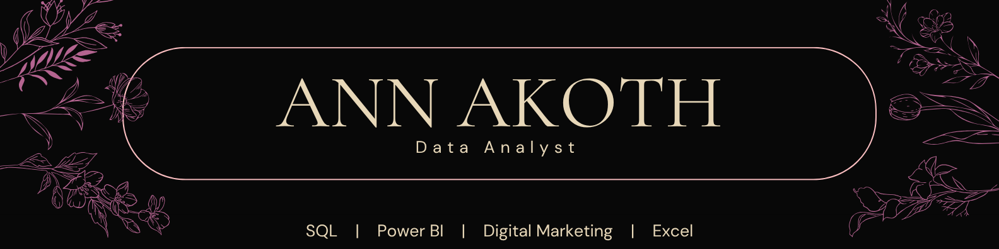
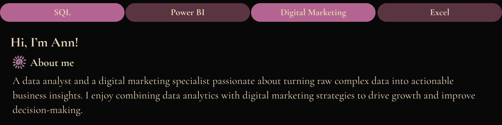
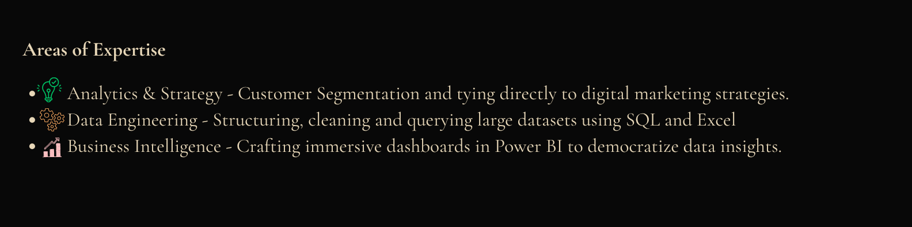

<!-- BANNER -->

  

<!-- CONNECT -->

  
  
  
  

  <map name="image-map">
    <area target="_blank" alt="LinkedIn" href="https://www.linkedin.com/in/akoth-ann-10835b246/" coords="422,221,275,271" shape="rect">
    <area target="_blank" alt="Email" href="annakoth64@gmail.com" coords="232,325,349,283" shape="rect">

 

<!-- ABOUT -->

  
  
  
  

This is the link: <u>https://github.com/annahthepooh/Data-Driven-Customer-Insights---Marketing-Strategy</u>

 

<!-- 2ND -->

  

This is the link: <u>https://github.com/annahthepooh/Customer-Segmentation-and-RFM-Based-Marketing-Strategies</u>

 

<!-- 3RD -->

  

This is the link: <u>https://github.com/annahthepooh/Retail-Sales-Performance-and-Customer-Insights-Analysis</u>

 

<!-- 4TH -->

  

This is the link: <u>https://github.com/annahthepooh/Employee-Attrition-Risk-Analysis-and-Retention-Strategy</u> 

 

<!-- CONTACT -->

  

